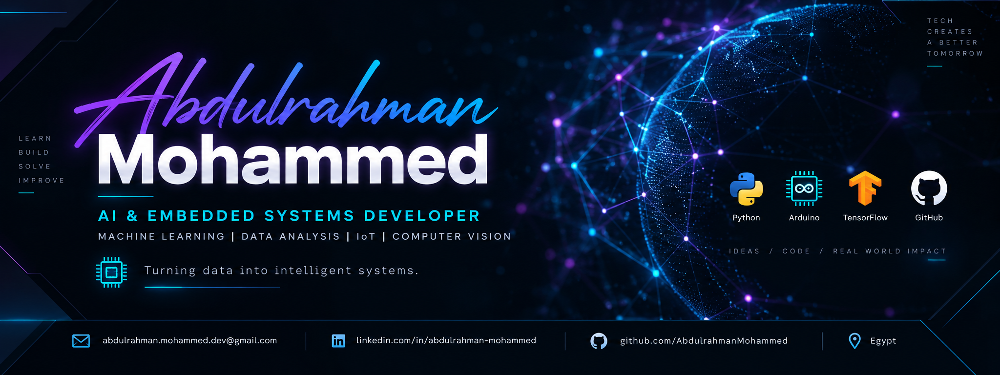

<div align="center">



<br><br>

# ABDULRAHMAN MOHAMMED

### AI DEVELOPER · GENERATIVE AI · COMPUTER VISION · EMBEDDED SYSTEMS

<p>
Building intelligent systems where <b>AI, data, vision and hardware</b> meet.
</p>

<p>
<a href="https://github.com/zbady991">

</a>
<a href="https://zbd-portofolio-holk.vercel.app/">

</a>
</p>

</div>

---

## WHO AM I?

I'm **Abdulrahman Mohammed**, an AI & Embedded Systems developer focused on turning data into practical intelligent systems.

My background combines:

-  Machine Learning & Deep Learning
-  Generative AI
-  Computer Vision
-  Data Analysis
-  Embedded Systems & IoT

I'm currently **learning and exploring Generative AI**, with a focus on understanding how modern AI systems can be built and integrated into real applications.

---

##  CURRENTLY LEARNING — GENERATIVE AI

> Exploring how modern generative models can turn information into useful intelligent applications.

```text
GENERATIVE AI
│
├── Large Language Models (LLMs)
├── Prompt Engineering
├── Embeddings
├── Retrieval-Augmented Generation (RAG)
├── Vector Databases
├── AI Agents
└── Generative AI Applications
```

**Learning path:**

`LLMs → Prompting → Embeddings → RAG → AI Agents → Real Applications`

---

##  MY TECH STACK

###  AI & MACHINE LEARNING

<p>

</p>

`Scikit-learn` · `Machine Learning` · `Deep Learning` · `Neural Networks`

**Algorithms**

`Logistic Regression` · `Random Forest` · `Decision Tree` · `SVM` · `KNN` · `Naive Bayes` · `PCA`

---

###  GENERATIVE AI

`LLMs` · `Prompt Engineering` · `RAG` · `Embeddings` · `Vector Databases` · `AI Agents`

> Currently developing my knowledge in Generative AI through hands-on learning and experimentation.

---

###  COMPUTER VISION

<p>

</p>

`OpenCV` · `YOLO` · `CNN` · `Image Processing` · `Face Detection` · `Face Recognition`

**Feature Extraction**

`HOG` · `LBP` · `FaceNet` · `MTCNN`

---

###  DATA ANALYSIS

<p>

</p>

`Pandas` · `NumPy` · `Matplotlib`

`Data Cleaning` · `Data Preprocessing` · `EDA` · `Visualization` · `Feature Engineering`

---

###  EMBEDDED SYSTEMS & IoT

<p>

</p>

`Arduino` · `ESP32` · `IoT` · `Sensors` · `Embedded Systems` · `ESP RainMaker`

---

###  TOOLS

<p>

</p>

`Git` · `GitHub` · `VS Code` · `Google Colab` · `Jupyter Notebook` · `MySQL` · `PostgreSQL`

---

##  FEATURED PROJECTS

<table>
<tr>
<td width="50%">

### 📡 ESP32 Smart Home

IoT-based smart home project using ESP32 with connected hardware and remote control.

**Stack:** `ESP32` `IoT` `ESP RainMaker`

<a href="https://github.com/zbady991/ESP32-Smart-Home-Direct-LED">View Project →</a>

</td>

<td width="50%">

###  Arduino Solar Tracker

Embedded system designed to track the sun using Arduino, sensors and control logic.

**Stack:** `Arduino` `Sensors` `Embedded`

<a href="https://github.com/zbady991/Arduino-Solar-Tracking-System">View Project →</a>

</td>
</tr>

<tr>
<td>

###  AI Agent — YOLO

Computer vision project exploring object detection with YOLO.

**Stack:** `Python` `YOLO` `Computer Vision`

<a href="https://github.com/zbady991/AI-Agent_YOLO_V1_">View Project →</a>

</td>

<td>

###  Computer Vision & CNN

Computer vision workflows involving image processing, CNN concepts and feature extraction.

**Stack:** `Python` `OpenCV` `CNN` `NumPy`

</td>
</tr>
</table>

---

##  HOW I APPROACH AI PROJECTS

```text
             ┌───────────────┐
             │     DATA      │
             └───────┬───────┘
                     ↓
             ┌───────────────┐
             │ PREPROCESSING │
             └───────┬───────┘
                     ↓
             ┌───────────────┐
             │    MODEL      │
             │  ML / DL / AI │
             └───────┬───────┘
                     ↓
             ┌───────────────┐
             │   EVALUATION  │
             └───────┬───────┘
                     ↓
             ┌───────────────┐
             │ REAL-WORLD APP │
             └───────────────┘
```

---

##  WHAT INTERESTS ME

| Area | Focus |
|---|---|
|  Generative AI | LLMs · RAG · AI Agents |
|  Machine Learning | Classification · Regression · Model Evaluation |
|  Computer Vision | YOLO · CNN · Face Recognition |
|  Data | Analysis · Visualization · Feature Engineering |
|  Embedded AI | Arduino · ESP32 · IoT |
|  Intelligent Systems | Connecting software with real-world hardware |

---

##  GITHUB

<div align="center">


<br>


</div>

---

## 🎯 CURRENT DIRECTION

```text
Machine Learning
       +
Computer Vision
       +
Generative AI
       +
Embedded Systems
       ↓
INTELLIGENT REAL-WORLD SYSTEMS
```

I'm interested in building projects that don't stop at a model or a piece of hardware — but connect **AI with real-world applications**.

---

## 🌱 THE JOURNEY

`LEARN` → `BUILD` → `EXPERIMENT` → `TEST` → `IMPROVE` → `DEPLOY`

---

<div align="center">

### 💡 TURNING DATA INTO INTELLIGENT SYSTEMS

<br>

<a href="https://github.com/zbady991">GitHub</a>
&nbsp; • &nbsp;
<a href="https://zbd-portofolio-holk.vercel.app/">Portfolio</a>

<br><br>


</div>
